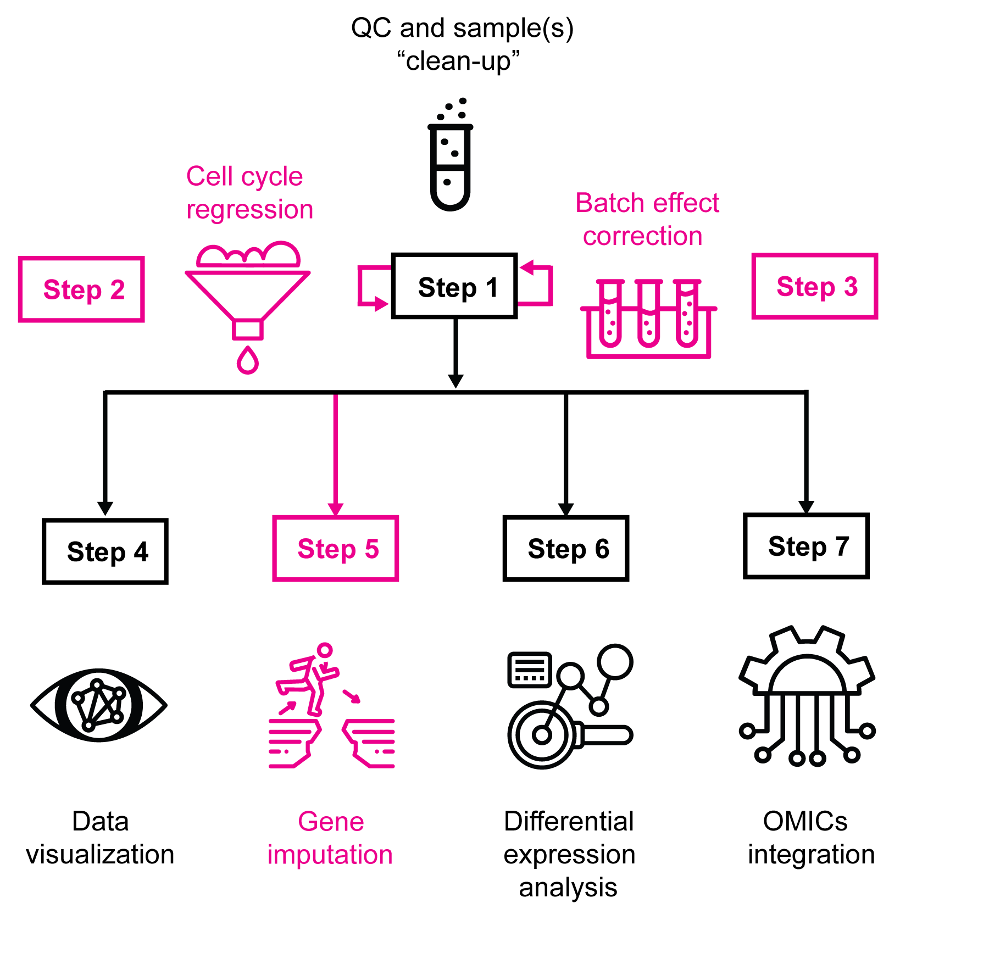

[](https://zenodo.org/badge/latestdoi/402799957)
# The shunPykeR's guide to single cell analysis
*Anastasia Kousa and Andri Lemarquis*

<br/>


*Similar to [the Hitchhiker's Guide to the Galaxy](https://en.wikipedia.org/wiki/The_Hitchhiker%27s_Guide_to_the_Galaxy), this guide has probably ended up in your "hands" due to a great catastrophe: your single cell data need to be analyzed and you don't know how to do it. Well, **DON'T PANIC**, this guide is here to help you skip all the hurdles of coding and decision making and let you get the most out of your data.*

*This guide starts with a click on the `Run` button. Once that is done, just keep clicking...*

<br/>

<p float="left">
  

**GRAPHICAL OVERVIEW**

**Step 1** guides you through the quality control and necessary clean-up tread that scRNA-seq data require. **Steps 2** and **3** are optional and can be skipped if initial inspection of the samples does not reveal any obvious technical artifacts that can bias results interpretation. **Step 4** introduces a plethora of common visualization options. **Step 5** provides again an optional practise to impute gene expression. This can be beneficial when interrogating in a correlative way the expression of lowly expressed genes, such as transcription factors, due to the high dropout rate that single cell data suffer from. **Step 6** walks you through differential expression analysis for your comparisons of interest, advices on pathway and network enrichment analysis options and provides complementary visualization for the specific output files. **Step 7** introduces ways of integrating your scRNA-seq data with (a) loom files to perform RNA velocity analysis, (b) visium files to probe the localization of the expressional data and (c) human/mouse orthologue to associate and inform the analysis from cross-species comparisons.

<sup> * *Magenta denotes optional analysis modules*</sup>

<br/>


##  This guide in a nutshell


This is a complete guide for the analysis of scRNA-seq data interlaced with sections of common and complementary practises. This guide introduces all code in one notebook in a coherent order and it has been "seeded" -where necessary- to make it fully reproducible. These two main qualities make it simple and intuitive enough allowing non computational scientists to perform a robust and thorough analysis of their scRNA-seq datasets with (relative) peace of mind. Nonetheless, it can be used by bioinformaticians that may want to adjust and reuse it in their own way.

Within this guide we have brought together a combination of already established single cell analysis tools that we introduced in a logical order to simplify running your analysis. The main code is in python but it is interpolated with snippets of R code to take advantage of both worlds when using single cell developed algorithms.

Here is the list of tools that we implement across this guide:
- **scanpy**<sup>1</sup> provides the backbone of this pipeline and allows for visualization options (https://scanpy.readthedocs.io/en/stable/)
- **scrublet**<sup>2</sup> removes doublet cells (https://github.com/swolock/scrublet)
- **leiden**<sup>3</sup> performs unsupervised clustering of the cells (https://github.com/vtraag/leidenalg)
- **harmony**<sup>4</sup> corrects batch effects (if applicable!) (https://scanpy.readthedocs.io/en/stable/generated/scanpy.external.pp.harmony_integrate.html)
- **magic**<sup>5</sup> imputes and denoises expression of selected genes (https://github.com/dpeerlab/magic)
- **wilcox**<sup>6</sup> performs differential expression analysis (https://en.wikipedia.org/wiki/Mann%E2%80%93Whitney_U_test)
- **GSEA**<sup>7</sup> runs pathway enrichment analysis (https://www.gsea-msigdb.org/gsea/index.jsp)
- **cytoscape::enrichmentmap**<sup>8,9</sup> runs network enrichment analysis (https://enrichmentmap.readthedocs.io/en/latest/)
- **velocyto**<sup>10,11</sup> performs rna velocity analysis (http://velocyto.org/)
- **scanorama**<sup>12</sup> carries out integration with spatial data (https://scanpy-tutorials.readthedocs.io/en/latest/spatial/integration-scanorama.html?highlight=scanorama#Integrating-spatial-data-with-scRNA-seq-using-scanorama)
- **mousipy** integrates human with mouse datasets (https://github.com/stefanpeidli/mousipy)

<br/>

## Emojis to guide your way


This icon (🕹️) helps you move directly to specific sections of this pipeline

This icon (💡) gives you hints to assist with issues when running this pipeline

This icon (✍️) let's you know that manual input is required

This icon (❗) asks you to pay attention

This icon (⏳) let's you know that the process may take a long time to run

<br/>

See the **complete notebook** [here](notebooks/shunPykeR_guide.ipynb).

<br/>


## How-to guide to open a Jupyter notebook

- For **Linux**, **Mac** and **Windows** environments

    1. Download and install the Anaconda-Navigator (https://docs.anaconda.com/anaconda/install/)
    2. Open the Anaconda-Navigator
    3. Go to `Environments` -> select an environment [default will be ` base(root)`] by clicking on the ▶️ button; select `shunPykeR` instead once you install it below
    4. Go to `Home` again -> on the Jupyter notebook box click on the `Install` button; once installed click on the `Launch` button
    5. Finally navigate through the browser that will pop up to the directory where your jupyter notebook exists and click on the file


## How-to guide to install the shunPykeR environment

- For **Linux** and **Mac** environments

    1. Install conda for your environment (https://docs.conda.io/projects/conda/en/latest/user-guide/install/windows.html)
    2. Use the search button to find and open a `terminal` window
    3. Type the command below

    ```
    conda env create -f shunPykeR.yml
    ```
    3. Once you see the cursor on the terminal blinking again the installation has finished
    4. Launch the Anaconda-Navigator and proceed as described above


- Alternatively, in a **Windows** environment or if you prefer a **graphical interface** to facilitate the installation (even though this can end up more tricky and slow)

    1. Open Anaconda-Navigator
    2. Go to Environments -> click on `Import`
    3. Select the `shunPykeR.yml` file and click `Import` again in the new window

<br/>

❗*Full environment installation has only been tested in a Mac environment via the terminal.*


<br/>

## Using the ShunPykeR docker image
Using Docker allows you to run ShunPykeR without having to manage any dependencies yourself other than installing Docker.

1. [Install Docker](https://docs.docker.com/get-docker/)
2. Run the following command in your terminal to download and start the Docker image:
   ```
    docker run -it --rm -p 8888:8888 -v "${PWD}":/home/jovyan/work  kousaa/shunpyker
   ```

3. navigate to the link shown in the console; it start with something like http://127.0.0.1:8888
4. **change your default kernal.** Once you open the notebook, change the kernal using the dropdown in the top right from `Python [conda_env: root]` to `Python [conda_env:shunPykeR]`

## Citations
<sup>**1.** 	F. A. Wolf, P. Angerer, F. J. Theis, SCANPY: large-scale single-cell gene expression data analysis. Genome Biol. 19, 15 (2018).
**2.** 	S. L. Wolock, R. Lopez, A. M. Klein, Scrublet: Computational Identification of Cell Doublets in Single-Cell Transcriptomic Data. Cell Syst. 8, 281-291.e9 (2019).
**3.** 	V. A. Traag, L. Waltman, N. J. van Eck, From Louvain to Leiden: guaranteeing well-connected communities. Sci. Rep. 9, 5233 (2019).
**4.** I. Korsunsky, N. Millard, J. Fan, K. Slowikowski, F. Zhang, K. Wei, Y. Baglaenko, M. Brenner, P. Loh, S. Raychaudhuri, Fast, sensitive and accurate integration of single-cell data with Harmony. Nat. Methods. 16, 1289–1296 (2019).
**5.** 	D. van Dijk, R. Sharma, J. Nainys, K. Yim, P. Kathail, A. J. Carr, C. Burdziak, K. R. Moon, C. L. Chaffer, D. Pattabiraman, B. Bierie, L. Mazutis, G. Wolf, S. Krishnaswamy, D. Pe’er, Recovering Gene Interactions from Single-Cell Data Using Data Diffusion. Cell. 174, 716-729.e27 (2018).
**6.** 	C. Soneson, M. D. Robinson, Bias, robustness and scalability in single-cell differential expression analysis. Nat. Methods. 15, 255–261 (2018).
**7.** 	A. Subramanian, P. Tamayo, V. K. Mootha, S. Mukherjee, B. L. Ebert, M. A. Gillette, A. Paulovich, S. L. Pomeroy, T. R. Golub, E. S. Lander, J. P. Mesirov, Gene set enrichment analysis: a knowledge-based approach for interpreting genome-wide expression profiles. Proc. Natl. Acad. Sci. U. S. A. 102, 15545–15550 (2005).
**8.** 	D. Merico, R. Isserlin, O. Stueker, A. Emili, G. D. Bader, Enrichment map: a network-based method for gene-set enrichment visualization and interpretation. PloS One. 5, e13984 (2010).
**9.** 	P. Shannon, A. Markiel, O. Ozier, N. S. Baliga, J. T. Wang, D. Ramage, N. Amin, B. Schwikowski, T. Ideker, Cytoscape: a software environment for integrated models of biomolecular interaction networks. Genome Res. 13, 2498–2504 (2003).
**10.** 	G. La Manno, R. Soldatov, A. Zeisel, E. Braun, H. Hochgerner, V. Petukhov, K. Lidschreiber, M. E. Kastriti, P. Lönnerberg, A. Furlan, J. Fan, L. E. Borm, Z. Liu, D. van Bruggen, J. Guo, X. He, R. Barker, E. Sundström, G. Castelo-Branco, P. Cramer, I. Adameyko, S. Linnarsson, P. V. Kharchenko, RNA velocity of single cells. Nature. 560, 494–498 (2018).
**11.** 	V. Bergen, M. Lange, S. Peidli, F. A. Wolf, F. J. Theis, Generalizing RNA velocity to transient cell states through dynamical modeling. Nat. Biotechnol. 38, 1408–1414 (2020).
**12.** 	B. Hie, B. Bryson, B. Berger, Efficient integration of heterogeneous single-cell transcriptomes using Scanorama. Nat. Biotechnol. 37, 685–691 (2019).
