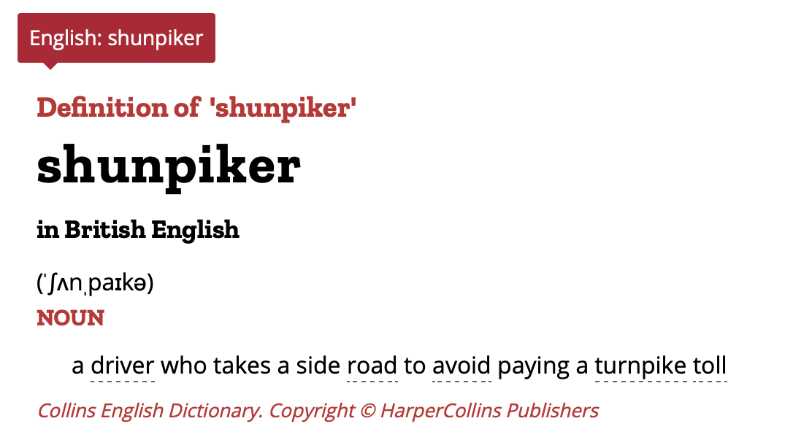

# The shunPykeR's guide to single cell RNA-seq analysis

*Similar to [The Hitchhiker's_Guide to the Galaxy](https://en.wikipedia.org/wiki/The_Hitchhiker%27s_Guide_to_the_Galaxy), this guide has probably ended up in your "hands" due to a great catastrophe: your single cell data need to be analyzed and you don't know how to do it. Well, **DON'T PANIC**, this guide is here to help you skip all the hurdles of coding and decision making and let you get the most out of your data.*

*This guide starts with a click on the `Run` button. Once that is done, just keep clicking...*

###  This guide in a nutshell

This guide is a complete pipeline for the analysis of scRNA-seq datasets from start to finish in python. It has been simplified by hiding more complex code snipsets behind the scenes (within the `shunpiker_modules.py` file) allowing non computational scientists to perform a robust and thorough analysis of their scRNA-seq datasets with (relative) peace of mind. However, it can also be used by bioinformaticians that may want to adjust it and reuse it in their own way. 

Within this guide we have brought together a combination of already established scRNA-seq analysis tools, that we have put together in a logical order to simplify running your analysis. A general rule of thumb for analyzing your data would be to discard "unwanted" cells on a per sample basis, while removing not expressed genes across all your samples together.

Here is the list of tools that we implement across this guide:
- **scanpy**1 provides the backbone of this pipeline and allows for visualization options (https://scanpy.readthedocs.io/en/stable/)
- **scrublet**2 remove doublet cells (https://github.com/swolock/scrublet)
- **phenoGraph**3 clusters cells based on their multi-dimensional enviroment (https://github.com/jacoblevine/PhenoGraph)

**Part 1** in this notebook guides you through fully analyzing one sample from scratch to finish, and also store the results for integration with other samples if necessary. If you only have one sample, then **Part 1** is all you need. You can then skip to **Part 3** to explore more visualization options for your data. If you have more than one sample, store good quality cells per sample using **Part 1** and then move to **Part 2** to integrate all your samples together. **Part 3** provides functions to allow data visualization, while **Part 4** let's you perform a differential expression analysis between your cluster of interest.

- **Part 1** Perform quality control and clean up each sample from scratch <a href='#part_1'>[here]</a>
- **Part 2** Intergrate together multiple "clean" samples <a href='#part_2'>[here]</a>
- **Part 3** Explore visualization alternatives <a href='#part_3'>[here]</a>
- **Part 4** Apply differential expression analysis <a href='#part_4'>[here]</a>
